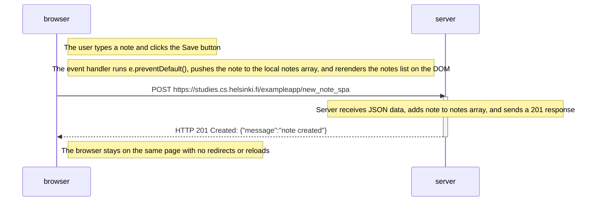

```mermaid
sequenceDiagram
    participant browser
    participant server

    Note right of browser: The user types a note and clicks the Save button

    Note right of browser: The event handler runs e.preventDefault(), pushes the note to the local notes array, and rerenders the notes list on the DOM

    browser->>server: POST https://studies.cs.helsinki.fi/exampleapp/new_note_spa
    activate server
    Note over server: Server receives JSON data, adds note to notes array, and sends a 201 response
    server-->>browser: HTTP 201 Created: {"message":"note created"}
    deactivate server

    Note right of browser: The browser stays on the same page with no redirects or reloads
```